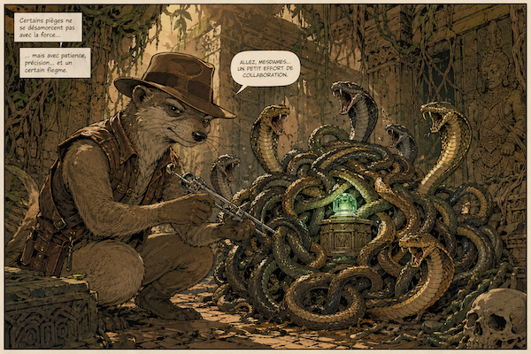

# snake-knot-picker



`snake-knot-picker` is a validation library for Go with a compact schema language built from CLI-style arguments.

It is designed for two use cases:

1. trusted admin-authored schemas that define what is allowed
2. strict user-side validation for untrusted input

Users only provide command argv. They never define schemas or register new commands.
Primary runtime usage is a tokenized argv list (`[]string`), for example:
`[]string{"wash", "start", "--spin", "1200"}`.
For repeatable flags, use tokenized form (`[]string{"--add", "value"}`); inline repeatable form (`--add=value`) is rejected by design.

## Entry points

Primary runtime API:

- `Validate(compiled CompiledCommand, argv []string) (*ParseResult, error)`
- `ValidateWithDocument(doc CommandDocument, argv []string) (*ParseResult, error)`
- `ValidateWithDocumentJSON(data []byte, argv []string) (*ParseResult, error)`

Schema/document API:

- `ParseCommandDocumentJSON(data []byte) (CommandDocument, error)`
- `CompileCommandDocument(doc CommandDocument) (CompiledCommand, error)`
- `CompileCommandDocumentWithOptions(doc CommandDocument, options CompileOptions) (CompiledCommand, error)`

Builder API:

- `NewCommandBuilder(commandPath ...string) *CommandBuilder`
- `(*CommandBuilder).AddFlag(flag CommandFlagDef) *CommandBuilder`
- `(*CommandBuilder).Build() CommandDocument`

## What it supports

- String validation for character sets, scripts, formats, prefixes, and custom rules
- Number validation and string-to-number conversion
- Tuple validation for fixed ordered values
- Repeatable flags with length bounds
- Formatters such as trim, lowercase, and uppercase
- Custom validators registered in Go and exposed through the same schema language
- A JSON-compatible schema shape for storing and exchanging command definitions

## Schema language

The schema language uses argv-style tokens so it stays easy to read, store, and parse.

Examples:

```text
schema string --enum cold,warm,hot --required
schema string --enum cold;warm;hot --enum-separator ;
schema string --uri --scheme https --secure --allow-query --allow-domains example.com
schema string --arn --allow-partition aws --allow-service s3 --allow-region us-east-2
schema string --date --layout ISO8601
schema string --datetime --layout RFC3339 --allow-timezone --location America/New_York
schema string --time --layout HHMMSS
schema string --duration --min-duration 5m --max-duration 2h
schema string --email --allow-domains example.com
schema string --color --format hex --allow-alpha
schema number --int --required
custom postal-code --country US --required
schema repeatable --min-length 1 --max-length 5
```

The same shape is used for built-in validators and custom Go-registered validators.
Enum definitions are split by their separator and must already be trimmed; whitespace-padded or empty enum entries are schema errors.
Errors carry stable IDs for program control and rendered messages for humans.
Admin schema commands are parsed and compiled into immutable validators before command registration.
Runtime user argv is parsed only against compiled command schemas; it must never compile schema commands or register operators.
The Go implementation should prefer small files with narrow responsibilities, with parser, compiler, argv, and concrete validator internals kept separate.

## Validation building blocks

### String validation

String validation covers:

- character classes like `digit`, `alphabetic`, `whitespace`, `blank`, and `hexa`
- Unicode classes like `unicodeLetter`, `unicodeNumber`, `unicodePunctuation`, `unicodeSymbol`, and `unicodeSeparator`
- script checks like `latin`, `han`, `arabic`, `hiragana`, `katakana`, `hangul`, `tamil`, and others
- format checks like `email`, `uri`, `date`, `datetime`, `time`, `duration`, `color`, and `base64`
- composition checks like `matchesFormatter(...)` and `number(...)`

### Number validation

Number validation supports:

- `min`
- `max`
- `multipleOf`
- `int`
- `float`
- parsing from string with dedicated converters

### Collections

- `tuple` validates fixed-position values
- `list` validates homogeneous collections

Tuple schema authoring guideline:

- Put tuple-level directives in `schema` (for example `schema tuple --size 2 --required`)
- Put each tuple slot validation and extra flag modifier in `schemas` as separate commands
- Make `--tuple <index>` mandatory in every tuple slot command

### Formatters

Formatters transform strings without being validations themselves.

- `trim`
- `lowercase`
- `uppercase`

You can also validate whether a formatter would change a string.

## Custom validators

Custom validators are registered in Go and exposed through the same schema registry as built-ins.

That means a validator like `postal-code` can be treated as a first-class schema operator rather than a special case.

## Design goals

- keep the schema surface compact
- make validation strict by default
- avoid ambiguous positional parsing
- keep the schema JSON-friendly
- allow custom validators without inventing a separate mini-language

## Project layout

- `doc/design-meta/examples/` contains the source-of-truth examples
- `doc/snake-knot-picker-hero.png` is the README illustration

## Contributing

Maintenance and contributor workflow is documented in [CONTRIBUTING.md](CONTRIBUTING.md).
Detailed API usage examples are documented in [USAGE.md](USAGE.md).
Compact command/operator reference is in [CHEATSHEET.md](CHEATSHEET.md).
